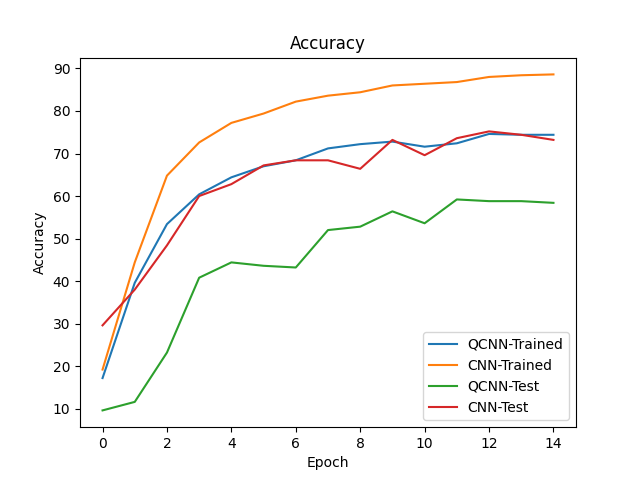
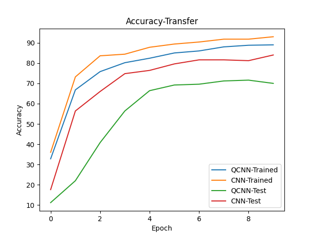
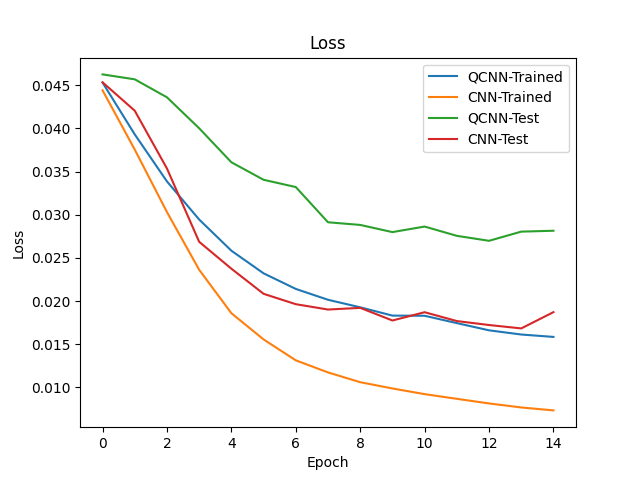
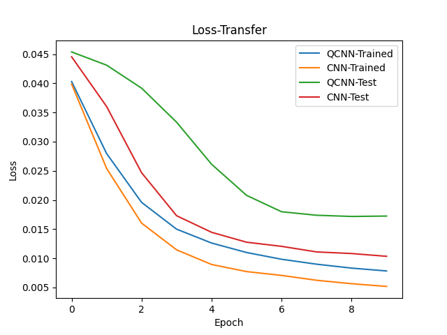

# Hybrid Quantum-Classical Convolutional Neural Network (QCNN)


Hackathon NCCU 2023

## Introduction

This project is focused on developing a hybrid quantum-classical convolutional neural network (QCNN) for image classification tasks. The QCNN is implemented using the `HybridQNN.py` module, which combines classical and quantum layers to create a more powerful neural network. The `Quanv2d.py` module is used to implement the quantum convolutional layer, which is a key component of the QCNN.

We also do transfer learning in `HybridQNN_Transfer.py` based on the weight result found in `HybrdQNN.py`.

The goal of this project is to explore the potential of QCNNs for image classification tasks, and to compare their performance to classical neural networks. We hope that this project will contribute to the growing field of quantum machine learning, and inspire further research in this area.


## Model

The `Quanv2d.py` module is used to implement the quantum convolutional layer, which is a key component of the hybrid quantum-classical convolution neural network (QCNN) for image classification tasks. This module defines the Quanv2d class, which inherits from the PyTorch nn.Module class and implements the quantum convolutional layer using the qiskit library.

The `HybridQNN.py` module combines classical and quantum layers to create a more powerful neural network. It defines the HybridQNN class, which inherits from the PyTorch nn.Module class and implements the hybrid QCNN using the Quanv2d class and other PyTorch layers. The HybridQNN class also includes methods for training and evaluating the QCNN on image classification tasks.

The `HybridQNN_Transfer.py` file contains the implementation of the `HybridQNN_Transfer` class, which is a transfer learning model based on the hybrid quantum-classical convolution neural network (QCNN) architecture. The convolutional part of this model utilizes weights trained in the HybridQNN to optimize our model.

## Model Summary 

### HybridQNN

| Layer (type) | Output Shape | Param # |
|--------------|--------------|---------|
| Conv2d    | [-1, 1, 26, 26] | 10 |
| BatchNorm2d | [-1, 1, 26, 26] | 2 |
| Sigmoid | [-1, 1, 26, 26] | 0 |
| MaxPool2d | [-1, 1, 13, 13] | 0 |
| MyQuanv2d | [-1, 2, 4, 4] | 9 |
| BatchNorm2d | [-1, 2, 4, 4] | 4 |
| ReLU | [-1, 2, 4, 4] | 0 |
| Flatten | [-1, 32] | 0 |
| Linear | [-1, 10] | 330 |

### HybridQNN_Transfer

<table>

  <tr><th colspan= 3 > Transfer Part</th></tr>
  <tr>
    <th>Layer (type)</th>
    <th>Output Shape</th>
    <th>Param #</th>
  </tr >
  <tr>
    <td>Conv2d</td>
    <td>[-1, 1, 26, 26]</td>
    <td>10</td>
  </tr>
  <tr>
    <td>BatchNorm2d</td>
    <td>[-1, 1, 26, 26]</td>
    <td>2</td>
  </tr>
  <tr>
    <td>Sigmoid</td>
    <td>[-1, 1, 26, 26]</td>
    <td>0</td>
  </tr>
  <tr>
    <td>MaxPool2d</td>
    <td>[-1, 1, 13, 13]</td>
    <td>0</td>
  </tr>
  <tr>
    <td>MyQuanv2d</td>
    <td>[-1, 2, 6, 6]</td>
    <td>9</td>
  </tr>
  <tr><th colspan= 3>Training Part</th></tr>
    <tr>
    <th>Layer (type)</th>
    <th>Output Shape</th>
    <th>Param #</th>
  </tr >
  <tr>
    <td>BatchNorm2d</td>
    <td>[-1, 2, 6, 6]</td>
    <td>4</td>
  </tr>
  <tr>
    <td>ReLU</td>
    <td>[-1, 2, 6, 6]</td>
    <td>0</td>
  </tr>
  <tr>
    <td>Flatten</td>
    <td>[-1, 72]</td>
    <td>0</td>
  </tr>
  <tr>
    <td>Linear</td>
    <td>[-1, 10]</td>
    <td>730</td>
  </tr>
</table>


## Extensibility

The Quanv2d class in `Quanv2d.py` is designed to be easily extensible, so that users can modify the quantum circuit to suit their needs. Users can inherit from the Quanv2d class and override the `build_circuit()` method to define their own quantum circuit. Here's an example of how to do this

```python
from Quanv2d import Quanv2d
from qiskit import QuantumCircuit
from qiskit.circuit import Parameter

class CustomQuanv2d(Quanv2d):
    def __init__(self,input_channel,output_channel,num_qubits,num_weight,kernel_size = 3,stride = 1):
        super().__init__(input_channel, output_channel, num_qubits, num_weight, kernel_size, stride)
    def build_circuit(self,num_weights : int,num_input : int,num_qubits : int = 3):
        qc = QuantumCircuit(num_qubits)
        weight_params = [Parameter('w{}'.format(i)) for i in range(num_weights)]
        input_params = [Parameter('x{}'.format(i)) for i in range(num_input)]
        '''
        Build your own quantum circuit here
        '''
        return qc, weight_params, input_params
```
## QCNN v.s. CNN

### Comparative Analysis:

- Param #:

    - QCNN's Param # in convolution layer is less than CNN

- Training Performance:

    - QCNN initially performs worse than CNN but gradually approaches or surpasses it in later stages.
    - Transfer learning, where QCNN weights are applied to transfer version QCNN, results in higher training accuracy, indicating the positive impact of transfer learning on improving QCNN performance.

- Testing Performance:

    - QCNN exhibits lower accuracy on the test set compared to CNN.
    - Transfer learning enhances QCNN's performance on the test set but remains slightly below CNN.

- Conclusion:

    - QCNN may be constrained by the influence of its quantum components during training, resulting in lower initial performance.
    - Transfer learning shows promise in improving QCNN performance, but further optimization is needed, especially on the test set.

### Final result (in MNIST)
<table>
  <tr>
    <th></th>
    <th>Before Transfer Learning</th>
    <th>With Transfer Learning</th>
  </tr>
  <tr>
    <td align="center">Accuracy</td>
    <td align="center"></td>
    <td align="center"></td>
  </tr>
  <tr>
    <td align="center">Loss</td>
    <td align="center"></td>
    <td align="center"></td>
  </tr>
</table>


## Prerequisites

Before running the code in this repository, you will need to set up your environment. Here are the steps to follow:

1. Clone the repository to your local machine:

    ```bash
    git clone https://github.com/miles0428/Hackthon-NCCU-2023.git
    ```

2. Install the required packages using pip (and the version):

    ```bash
    pip install -r requirements.txt
    ```

    This will install all the necessary packages, including PyTorch, qiskit, and matplotlib.

3. Hardware

## License Information

This project is licensed under the Apache License 2.0. See [LICENSE](LICENSE) for more information.

## References

- [HHybrid Quantum-Classical Convolutional Neural Networks](https://arxiv.org/pdf/1911.02998.pdf)
- [Qiskit Documentation](https://qiskit.org/documentation/)
- [PyTorch Documentation](https://pytorch.org/docs/stable/index.html)
- [Github Copilot](https://thanksforthecode.com)
